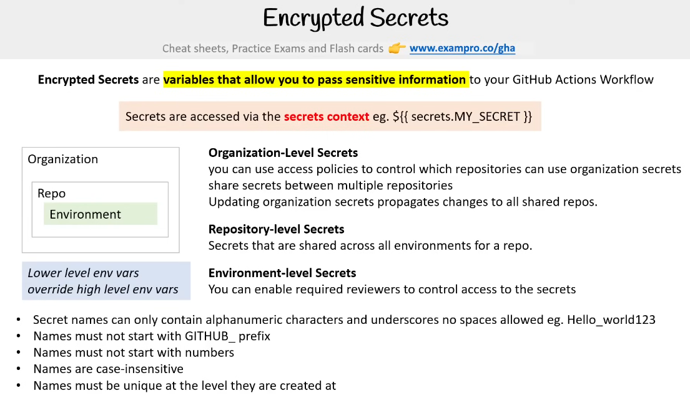

Sure! Here's a more detailed and comprehensive guide on GitHub Actions, covering as much ground as possible, including events, jobs, workflows, and many other advanced concepts:

---

## **GitHub Actions Comprehensive Guide**

### **1. Introduction to GitHub Actions**

GitHub Actions is a feature within GitHub that automates workflows in response to events that occur in a repository. It enables Continuous Integration (CI), Continuous Deployment (CD), and other automation tasks directly in GitHub repositories.

#### **Key Concepts**:
- **Workflow**: A YAML file that defines a set of automated tasks (jobs) that run in response to specific events.
- **Event**: An action that triggers a workflow, such as pushing code or creating a pull request.
- **Job**: A set of steps that run on a specified runner environment.
- **Step**: A single task in a job, which could be a script, a GitHub Action, or a shell command.
- **Runner**: A server or environment that runs your workflow jobs. It can be hosted by GitHub (GitHub-hosted runner) or self-hosted.


---

### **2. Events in GitHub Actions**

Events are the trigger points that activate workflows. Here are the different types of events you can use in GitHub Actions:

#### **Common Event Types**:

1. **Push Event** (`push`):
   - Triggered when commits are pushed to the repository.
   - Can be limited to specific branches or paths.

   ```yaml
   on:
     push:
       branches:
         - main
       paths:
         - '**/*.js'
   ```

2. **Pull Request Event** (`pull_request`):
   - Triggered when a pull request is created or updated.
   - Can be configured to trigger on specific actions, such as opened, edited, or closed.

   ```yaml
   on:
     pull_request:
       types: [opened, closed]
   ```

3. **Issue Event** (`issues`):
   - Triggered when an issue is created, edited, or closed.
   - Useful for automating issue handling or interacting with GitHub Issues.

   ```yaml
   on:
     issues:
       types: [opened, edited, closed]
   ```

4. **Release Event** (`release`):
   - Triggered when a release is created, published, or deleted.

   ```yaml
   on:
     release:
       types: [created, published]
   ```

5. **Workflow Dispatch (Manual Trigger)** (`workflow_dispatch`):
   - Allows a workflow to be triggered manually via the GitHub UI.
   - Supports inputs that can be specified during the manual trigger.

   ```yaml
   on:
     workflow_dispatch:
       inputs:
         deploy_env:
           description: 'Deployment Environment'
           required: true
           default: 'staging'
   ```

6. **Scheduled Event** (`schedule`):
   - Allows workflows to run at specific times, like cron jobs.
   - Can be used for tasks that need to run periodically, such as nightly builds or cleanup jobs.

   ```yaml
   on:
     schedule:
       - cron: '0 0 * * *'  # Runs at midnight every day
   ```

7. **Webhooks** (`webhook`):
   - Custom events that can trigger workflows based on external services or HTTP requests.

8. **Commit Status Event** (`status`):
   - Triggered when the status of a commit changes. This can be used for status checks, build results, etc.

---

### **3. Jobs and Runners**

- **Job**: A set of steps that run in a defined environment, called a **runner**. Jobs can run in parallel or in a defined sequence (one after another).
  
  Example:
  ```yaml
  jobs:
    build:
      runs-on: ubuntu-latest
      steps:
        - name: Checkout Code
          uses: actions/checkout@v2
  ```

- **Runners**: The environment in which your jobs run. There are two types of runners:
  1. **GitHub-hosted runners**: Pre-configured environments provided by GitHub (e.g., Ubuntu, Windows, Mac).
  2. **Self-hosted runners**: Custom environments that you configure yourself.

  Example of using a self-hosted runner:
  ```yaml
  jobs:
    build:
      runs-on: self-hosted
      steps:
        - name: Checkout code
          uses: actions/checkout@v2
  ```

---

### **4. Workflow Components and Structure**

A typical workflow consists of the following components:

1. **name**: A name for your workflow.
2. **on**: Specifies the event that triggers the workflow (e.g., `push`, `pull_request`).
3. **jobs**: Contains one or more jobs to be executed.
4. **steps**: A sequence of individual tasks that make up a job.

Example workflow structure:
```yaml
name: CI Workflow

on:
  push:
    branches:
      - main

jobs:
  build:
    runs-on: ubuntu-latest
    steps:
      - name: Checkout code
        uses: actions/checkout@v2
      - name: Set up Node.js
        uses: actions/setup-node@v2
        with:
          node-version: '14'
      - name: Run tests
        run: npm test
```

---

### **5. Steps in a Job**

Steps are individual tasks that run in a sequence. A step can either run a command or use an action.

1. **Using Actions**:
   Actions are reusable pieces of code that automate common tasks. GitHub provides a marketplace for actions.

   Example:
   ```yaml
   steps:
     - name: Checkout repository
       uses: actions/checkout@v2
   ```

2. **Running Commands**:
   Steps can also run shell commands directly.

   Example:
   ```yaml
   steps:
     - name: Run test script
       run: npm test
   ```

---

### **6. Context and Expressions**

GitHub Actions provides **contexts** and **expressions** to use dynamic values in your workflows. These allow you to access information about the workflow, job, and other entities.

#### **Context**:
A **context** provides information about the workflow run and is used within expressions. Examples include:
- `github` – Information about the GitHub environment (repository name, actor, etc.).
- `env` – Access to environment variables.
- `secrets` – Access to secrets stored in GitHub.

#### **Expression**:
Expressions allow you to evaluate and access context variables dynamically using `${{ }}` syntax.

Example:
```yaml
jobs:
  build:
    runs-on: ubuntu-latest
    steps:
      - name: Print current commit SHA
        run: echo "Commit SHA: ${{ github.sha }}"
```

---

### **7. Environment Variables and Secrets**

- **Environment Variables**: These are global values that are available for the entire job. You can use them to store values that you want to access in multiple steps.

Example of setting environment variables:
```yaml
jobs:
  build:
    runs-on: ubuntu-latest
    env:
      NODE_ENV: 'production'
    steps:
      - name: Print NODE_ENV
        run: echo $NODE_ENV
```

- **Secrets**: Store sensitive data securely in the repository settings, and reference them in your workflow using `${{ secrets.SECRET_NAME }}`.

Example of using a secret:
```yaml
jobs:
  deploy:
    runs-on: ubuntu-latest
    steps:
      - name: Deploy to server
        run: deploy.sh
        env:
          API_KEY: ${{ secrets.API_KEY }}
```

---

### **8. Matrix Builds**

A matrix build allows you to run multiple jobs with different configurations (like testing on different versions of Node.js or Python).

Example of a job matrix:
```yaml
jobs:
  build:
    runs-on: ubuntu-latest
    strategy:
      matrix:
        node: [12, 14, 16]  # Test across three versions of Node.js
    steps:
      - name: Set up Node.js
        uses: actions/setup-node@v2
        with:
          node-version: ${{ matrix.node }}
      - name: Run tests
        run: npm test
```

---

### **9. Caching Dependencies**

GitHub Actions allows you to cache dependencies between workflow runs to save time. This is particularly useful for managing package dependencies (e.g., Node.js `npm` or Python `pip`).

Example:
```yaml
steps:
  - name: Cache Node.js dependencies
    uses: actions/cache@v2
    with:
      path: ~/.npm
      key: ${{ runner.os }}-node-${{ hashFiles('**/package-lock.json') }}
      restore-keys: |
        ${{ runner.os }}-node-
```

---

### **10. Deployments and Publishing**

GitHub Actions can be used to automate deployments and publish content, such as pushing Docker images to Docker Hub or creating releases.

#### **Publish a GitHub Package**:
```yaml
jobs:
  publish:
    runs-on: ubuntu-latest
    steps:
      - name: Publish to GitHub Package Registry
        run: npm publish
        env:
          NODE_AUTH_TOKEN: ${{ secrets.GITHUB_TOKEN }}
```

#### **Deploying to Cloud Providers**:
You can use GitHub Actions to deploy applications to cloud services (e.g., AWS, Azure, Google Cloud) by setting up the appropriate actions or using CLI commands in your steps.

---

### **11. Advanced Topics**

#### **Self-Hosted Runners**:
Setting up self-hosted runners enables you to use your own machines to run workflows. This is useful for more control, custom environments, or private network access.

#### **Reusable Workflows**:
Workflows can be reused across multiple repositories or workflows to avoid duplication.

Example:
```yaml
jobs

:
  reuse:
    uses: user/repo/.github/workflows/reusable-workflow.yml@v1
```

#### **Custom GitHub Actions**:
If existing actions do not meet your needs, you can create custom GitHub Actions using Docker or JavaScript.

---

### **12. Best Practices and Optimization**

1. **Workflow Status Badge**: Add a status badge to your README to show the status of your workflows.

2. **Handling Failures**: Use `continue-on-error: true` for steps or jobs that you do not want to fail the workflow.

3. **Workflow Secrets Management**: Always use GitHub's secrets feature to manage sensitive data securely.

4. **Job Matrix for Parallel Testing**: Use job matrices to run tests across multiple environments (e.g., different OS versions or languages).

---

This comprehensive guide should help you dive deep into GitHub Actions and its capabilities. Let me know if you need more clarification or further examples!


---


## **Scheduling cron Jobs**:


## **Triggering Single or Multiple Events**:


---


### **Webhook Triggers (Built-In GitHub Events)**

GitHub Actions supports a wide range of built-in webhook events. These events are emitted when specific actions occur in your GitHub repository or organization. Below is a categorized list of commonly used events:

#### **Code and Repository Events**
- **`push`**: Triggered on a `git push` to a branch.
- **`pull_request`**: Triggered on PR events like `opened`, `closed`, `merged`, etc.
- **`issues`**: Triggered on issue events like `opened`, `edited`, `deleted`.
- **`create` / `delete`**: Triggered when a branch or tag is created or deleted.
- **`fork`**: Triggered when a repository is forked.
- **`repository_dispatch`**: Custom external trigger (discussed below in detail).

#### **Release and Deployment Events**
- **`release`**: Triggered on events like creating, editing, or publishing a release.
- **`workflow_dispatch`**: Manual workflow trigger via GitHub Actions UI.
- **`deployment`**: Triggered when a deployment is created.
- **`deployment_status`**: Triggered when a deployment status changes.

#### **Collaboration Events**
- **`pull_request_review`**: Triggered when a PR review is submitted.
- **`pull_request_target`**: Similar to `pull_request`, but runs with the target repository's permissions.
- **`discussion`**: Triggered on GitHub Discussions events.
- **`star`**: Triggered when someone stars a repository.

#### **Automation and Security Events**
- **`schedule`**: Triggered on a cron-like schedule (time-based workflows).
- **`workflow_run`**: Triggered when another workflow completes.
- **`check_run` / `check_suite`**: Triggered by status checks.

---

### **Custom Webhook Triggers**

#### **1. `workflow_dispatch` (Manual Trigger)**
This allows you to manually trigger workflows via the GitHub Actions UI, with optional input parameters.

**Example Workflow**:
```yaml
name: Manual Trigger Workflow

on:
  workflow_dispatch:
    inputs:
      environment:
        description: 'Deployment environment'
        required: true
        default: 'production'

jobs:
  manual-trigger:
    runs-on: ubuntu-latest
    steps:
      - name: Print Environment
        run: echo "Deploying to ${{ github.event.inputs.environment }}"
```

---

#### **2. `repository_dispatch` (External Trigger)**

This is triggered by external systems sending a `POST` request to the GitHub API, allowing workflows to respond to events outside GitHub.

**Example Workflow**:
```yaml
name: External Trigger Workflow

on:
  repository_dispatch:
    types:
      - sync-data

jobs:
  external-trigger:
    runs-on: ubuntu-latest
    steps:
      - name: Print Payload
        run: echo "Triggered by: ${{ toJSON(github.event.client_payload) }}"
```

**API Call to Trigger**:
```bash
curl -X POST \
-H "Authorization: Bearer YOUR_GITHUB_TOKEN" \
-H "Accept: application/vnd.github+json" \
https://api.github.com/repos/<OWNER>/<REPO>/dispatches \
-d '{"event_type": "sync-data", "client_payload": {"key": "value"}}'
```

---

### **Types of `repository_dispatch`**

You can define multiple custom `event_type` values:
- **sync-data**
- **run-tests**
- **update-logs**
- These are arbitrary and allow you to customize workflows based on your needs.

---

### **Differences Between `workflow_dispatch` and `repository_dispatch`**
| Feature                | `workflow_dispatch`            | `repository_dispatch`        |
|------------------------|---------------------------------|------------------------------|
| **Triggered By**       | Manual via GitHub UI           | External system/API call     |
| **Supports Inputs**    | Yes                            | Yes (via `client_payload`)   |
| **Use Case**           | Manual triggers for workflows  | Integrating with external systems |

---

### **Examples of Use Cases**

#### **1. Custom CI/CD Pipeline**
Use `repository_dispatch` to trigger a CI/CD pipeline when a new version of software is released in an external system.

#### **2. Synchronize Data**
Trigger workflows to fetch data from APIs, update configurations, or sync databases.

#### **3. Time-Based Automation**
Combine `schedule` and `repository_dispatch` for complex time-based tasks that also require external system integration.

---

These webhook triggers make GitHub Actions versatile, allowing automation for both internal GitHub events and external systems.


---

### Conditionals


In GitHub Actions, **conditionals** control whether a workflow, job, or step should run. These conditions use the **`if`** keyword and evaluate expressions based on context and variables.

Here’s a breakdown of conditionals in GitHub Actions:

---

### **1. Conditional Execution for Workflows**

While workflows don’t have direct `if` conditions, you can control execution using specific events and filters (e.g., branches, tags). 

**Example: Run workflow only on `main` branch**:
```yaml
on:
  push:
    branches:
      - main
```

---

### **2. Conditional Execution for Jobs**

Jobs can have conditions using the `if` keyword.

**Syntax**:
```yaml
jobs:
  job-name:
    if: <condition>
    runs-on: ubuntu-latest
```

**Example: Run a job only for PRs**:
```yaml
jobs:
  build:
    if: github.event_name == 'pull_request'
    runs-on: ubuntu-latest
    steps:
      - run: echo "This job runs only for PRs"
```

---

### **3. Conditional Execution for Steps**

Steps can also use the `if` keyword to control execution.

**Syntax**:
```yaml
steps:
  - name: Step Name
    if: <condition>
    run: <command>
```

**Example: Run step only if a previous step succeeds**:
```yaml
steps:
  - name: Build
    run: echo "Building..."
  - name: Deploy
    if: success()
    run: echo "Deploying..."
```

---

### **Common Conditions**

Here are some commonly used conditions:

#### **Status Conditions**
- **`success()`**: Step or job runs if all previous steps/jobs succeeded.
- **`failure()`**: Runs if a previous step/job failed.
- **`always()`**: Runs regardless of success or failure.
- **`cancelled()`**: Runs if the workflow was canceled.

#### **Event-Specific Conditions**
- **Check event type**:
  ```yaml
  if: github.event_name == 'push'
  ```
- **Filter branch or tag**:
  ```yaml
  if: startsWith(github.ref, 'refs/heads/main')
  ```

#### **Environment Variables and Context**
- **Use GitHub context**:
  ```yaml
  if: github.actor == 'octocat'
  ```
- **Use inputs**:
  ```yaml
  if: inputs.environment == 'production'
  ```

#### **Boolean Logic**
Combine multiple conditions using `&&`, `||`, and `!`.

**Example: Only on main branch and success**:
```yaml
if: github.ref == 'refs/heads/main' && success()
```

---

### **Example Workflow with Conditionals**

```yaml
name: Conditional Workflow

on:
  push:
    branches:
      - main

jobs:
  build:
    runs-on: ubuntu-latest
    steps:
      - name: Build Code
        run: echo "Building..."
      - name: Deploy to Production
        if: github.ref == 'refs/heads/main' && success()
        run: echo "Deploying to production!"
```

---

### **Advanced Conditional Triggers**

#### Use Inputs for Conditional Logic:
```yaml
on:
  workflow_dispatch:
    inputs:
      deploy:
        description: 'Should deploy'
        required: true
        default: 'false'

jobs:
  deploy:
    runs-on: ubuntu-latest
    if: github.event.inputs.deploy == 'true'
    steps:
      - run: echo "Deploying as per input!"
```

---

Conditionals in GitHub Actions allow workflows to adapt dynamically based on context, inputs, and statuses, providing flexibility and control over execution!


---

### Expressions


Expressions in GitHub Actions are used to evaluate conditions and set dynamic values. Here’s a concise guide covering all the essentials:


### **1. Basic Syntax**
Expressions are enclosed in double curly braces `{{ }}` and evaluated with the `$` symbol:
```yaml
if: ${{ <expression> }}
```

---

### **2. Operators**
#### **Arithmetic Operators**
- `+`, `-`, `*`, `/`, `%`
- Example: `$((3 + 2))` → `5`

#### **Comparison Operators**
- `==`, `!=`, `<`, `<=`, `>`, `>=`
- Example: `$((1 > 0))` → `true`

#### **Logical Operators**
- `&&` (AND), `||` (OR), `!` (NOT)
- Example: `$((true && false))` → `false`

---

### **3. Functions**
#### **Status Checks**
- `success()` → Returns `true` if previous steps/jobs succeeded.
- `failure()` → Returns `true` if any previous step/job failed.
- `cancelled()` → Returns `true` if the workflow was canceled.
- `always()` → Always returns `true`.

#### **String Functions**
- `startsWith(string, prefix)`
- `endsWith(string, suffix)`
- `contains(string, substring)`
- Example: `$((startsWith('main', 'm')))` → `true`

#### **Utility Functions**
- `format()` → Formats a string.
- `join(array, delimiter)` → Joins array elements.
- `toJSON(value)` → Converts a value to JSON.

---

### **4. Contexts**
Contexts provide dynamic information. Common ones include:

#### **GitHub Context**
- `github.event_name` → The name of the triggering event.
- `github.actor` → The user who triggered the workflow.
- `github.ref` → The branch or tag ref.

#### **Job Context**
- `job.status` → Status of the current job: `success`, `failure`, or `cancelled`.

#### **Runner Context**
- `runner.os` → Operating system of the runner.

#### **Secrets Context**
- `secrets.<name>` → Access to GitHub secrets.
- Example: `secrets.MY_SECRET`

#### **Env Context**
- `env.<name>` → Access to environment variables.
- Example: `env.DEPLOY_ENV`

#### **Inputs Context**
- `inputs.<name>` → Inputs passed to the workflow.
- Example: `inputs.environment`

---

### **5. Examples**

#### Conditional Branch Check:
```yaml
if: ${{ github.ref == 'refs/heads/main' }}
```

#### Check Pull Request Author:
```yaml
if: ${{ github.event.pull_request.user.login == 'octocat' }}
```

#### Run Step Only on Success:
```yaml
if: ${{ success() }}
```

#### Format a String:
```yaml
run: echo "${{ format('Deploying to {0}', github.ref) }}"
```

#### Combine Conditions:
```yaml
if: ${{ github.actor == 'octocat' && github.event_name == 'push' }}
```

---

These expressions allow dynamic, flexible workflows tailored to your automation needs!


---

### Runners

In GitHub Actions, **runners** are the virtual environments where your workflows are executed. They are responsible for running the jobs defined in your workflow files. Runners are where the actual execution of your code, commands, and steps takes place.


### Types of Runners

1. **GitHub-Hosted Runners:**
   These are virtual machines provided by GitHub that are preconfigured with popular software tools. GitHub maintains, updates, and manages these runners, so you don’t need to worry about the underlying infrastructure. They are typically used for general-purpose workflows.

   - **Operating Systems Available:**
     - Ubuntu (latest versions)
     - Windows (latest versions)
     - macOS (latest versions)

   - **Example of using a GitHub-hosted runner:**
     ```yaml
     jobs:
       build:
         runs-on: ubuntu-latest
         steps:
           - uses: actions/checkout@v2
           - run: echo "Hello, World!"
     ```

   - **Advantages:**
     - No setup required—GitHub takes care of the infrastructure.
     - Preconfigured with common tools and languages (Node.js, Python, Java, etc.).
     - Automatically updated with the latest patches.

   - **Disadvantages:**
     - Limited control over the environment (you can't install custom software by default).
     - They might have resource limitations (e.g., CPU, memory, disk space) depending on your usage.

2. **Self-Hosted Runners:**
   These are machines that you set up and configure yourself, either on your own hardware or in a cloud environment. They allow more customization and control over the environment, enabling you to install specific software, tools, or configurations that are required for your workflows.

   - **Example of using a self-hosted runner:**
     ```yaml
     jobs:
       build:
         runs-on: self-hosted
         steps:
           - uses: actions/checkout@v2
           - run: echo "Custom build on self-hosted runner!"
     ```

   - **Advantages:**
     - Full control over the environment (you can install any software you need).
     - Can be used for workflows that require specific tools or hardware configurations.
     - Can be more cost-effective for large-scale workflows or for workflows that require more resources than GitHub-hosted runners provide.
   
   - **Disadvantages:**
     - You need to set up and maintain the runner (including updates, security, etc.).
     - You are responsible for scaling and handling issues such as hardware failures.

### Key Properties of Runners:

- **Runs-on:** The `runs-on` key specifies which type of runner the job should run on. It can either be `ubuntu-latest`, `windows-latest`, `macos-latest` (for GitHub-hosted runners) or a custom label for a self-hosted runner.

- **Self-hosted Runners Labels:** When using self-hosted runners, you can assign labels to them to help organize or filter which runners to use for specific jobs. For example:
  ```yaml
  jobs:
    build:
      runs-on: [self-hosted, linux]
  ```

- **Environment Setup:** For self-hosted runners, you can install any software you need for your workflows (e.g., database servers, specific language versions, etc.).

- **Virtual Environments:** GitHub-hosted runners use virtual environments that are discarded after the workflow completes. This means that each workflow run starts with a fresh environment. For self-hosted runners, the environment persists between workflow runs, so you can maintain data or software installed from previous runs.

### Runner Lifecycle:
1. **Job Queue:** When a workflow is triggered, GitHub checks for an available runner to execute the job.
2. **Runner Start:** If the runner is not already running, GitHub starts the appropriate runner based on the `runs-on` specification.
3. **Job Execution:** The runner executes each step in the workflow until it completes or fails.
4. **Post-job Cleanup:** For GitHub-hosted runners, the environment is discarded once the job is done. For self-hosted runners, the environment persists for further jobs until manually cleaned up.

### Example of Runner Usage in GitHub Actions YAML:
```yaml
name: Build and Test

on: [push]

jobs:
  test:
    runs-on: ubuntu-latest  # Use a GitHub-hosted Ubuntu runner
    steps:
      - uses: actions/checkout@v2
      - run: npm install
      - run: npm test
  deploy:
    runs-on: self-hosted  # Use a self-hosted runner
    steps:
      - uses: actions/checkout@v2
      - run: ./deploy-script.sh
```

### Conclusion:
- **GitHub-hosted runners** are easier to use and set up, suitable for most general use cases.
- **Self-hosted runners** provide greater control and flexibility, ideal for custom environments, complex workflows, or specific resource needs.

You can choose between these based on your project’s needs, scale, and level of customization required for your workflows.


---

### Workflow commands


Workflow commands in GitHub Actions allow you to interact with the workflow runner's environment. These commands are executed using special syntax inside a workflow and help set environment variables, add annotations, mask secrets, and more.

Here’s a list of commonly used workflow commands:

---

### **1. `echo` for Workflow Commands**
To invoke a command, you use `echo` with the prefix `::`.

#### Syntax:
```bash
echo "::command parameter=value::message"
```

---

### **2. Workflow Command Examples**

#### **Set Environment Variables**
You can create or update an environment variable using the `set-env` command.

```bash
echo "MY_VAR=value" >> $GITHUB_ENV
```

- Example:
  ```yaml
  - name: Set environment variable
    run: echo "MY_VAR=Hello World" >> $GITHUB_ENV
  - name: Use the variable
    run: echo "The value is $MY_VAR"
  ```

---

#### **Set Output for Steps**
Pass values from one step to another using outputs.

```bash
echo "::set-output name=var_name::value"
```

- Example:
  ```yaml
  - name: Set output
    id: step1
    run: echo "value=Hello World" >> $GITHUB_ENV

  - name: Use output
    run: echo "The output is ${{ steps.step1.outputs.var_name }}"
  ```

> **Note**: `set-output` is deprecated. Use `GITHUB_ENV` for modern workflows.

---

#### **Group Logs**
Group related logs for better readability in the Actions console.

```bash
echo "::group::Group Name"
# Log output
echo "Log message"
echo "::endgroup::"
```

- Example:
  ```yaml
  - name: Group logs
    run: |
      echo "::group::Start of logs"
      echo "This is inside the group."
      echo "::endgroup::"
  ```

---

#### **Add Annotations**
Add annotations like warnings, errors, or notices to the logs.

- **Warning:**
  ```bash
  echo "::warning file=app.js,line=10,col=15::This is a warning message"
  ```

- **Error:**
  ```bash
  echo "::error file=app.js,line=10,col=15::This is an error message"
  ```

- **Notice:**
  ```bash
  echo "::notice file=app.js,line=10,col=15::This is a notice"
  ```

---

#### **Mask Sensitive Data**
To hide sensitive information in logs, use the `add-mask` command.

```bash
echo "::add-mask::sensitive_value"
```

- Example:
  ```yaml
  - name: Mask sensitive data
    run: echo "::add-mask::my-secret-value"
  ```

---

#### **Set Debug Mode**
Enable debug messages for troubleshooting.

```bash
echo "::debug::This is a debug message"
```

- Example:
  ```yaml
  - name: Debug example
    run: echo "::debug::Debugging workflow step"
  ```

---

#### **Stop Workflow Execution**
You can cancel or skip steps using `cancel` or `fail`.

- **Cancel Workflow:**
  ```bash
  echo "::cancel::Cancelling the workflow"
  ```

- **Fail Workflow:**
  ```bash
  echo "::error::Failing the workflow intentionally"
  ```

---

#### **Set Status Check Results**
Report success or failure of individual steps or actions.

```bash
echo "::set-output name=step-result::success"
```

---

#### **Upload Artifacts**
Use the `actions/upload-artifact` action to save files or logs for later use.

```yaml
- name: Upload logs
  uses: actions/upload-artifact@v3
  with:
    name: my-logs
    path: ./logs/
```

---

### Summary Table of Commands:

| Command            | Description                                |
|--------------------|--------------------------------------------|
| `GITHUB_ENV`       | Set environment variables.                |
| `::group::`        | Start a log group.                        |
| `::endgroup::`     | End a log group.                          |
| `::debug::`        | Add debug information.                    |
| `::warning::`      | Add a warning annotation.                 |
| `::error::`        | Add an error annotation.                  |
| `::notice::`       | Add a notice annotation.                  |
| `::add-mask::`     | Mask sensitive data in logs.              |
| `::set-output::`   | Pass outputs between steps (deprecated).  |
| `actions/upload-artifact` | Save files for later use.          |

---

Would you like to see how these commands can be used in a complete workflow example?


---

### Workflow Contexts in GitHub Actions

GitHub Actions provides **contexts** that allow workflows to access information about the workflow run, repository, and environment. These are predefined variables that you can use in expressions or directly in workflows.


---

### Major Contexts and Examples

#### 1. **`github` Context**
   Provides details about the repository, event, and workflow.

   ```yaml
   run: echo "Repository: ${{ github.repository }}"
   run: echo "Event name: ${{ github.event_name }}"
   run: echo "Run number: ${{ github.run_number }}"
   run: echo "Commit SHA: ${{ github.sha }}"
   ```

#### 2. **`env` Context**
   Access environment variables set during the workflow.

   ```yaml
   run: echo "Environment variable MY_VAR: ${{ env.MY_VAR }}"
   ```

#### 3. **`job` Context**
   Contains information about the current job.

   ```yaml
   run: echo "Job ID: ${{ job.id }}"
   run: echo "Job status: ${{ job.status }}"
   ```

#### 4. **`runner` Context**
   Provides information about the runner instance.

   ```yaml
   run: echo "Runner OS: ${{ runner.os }}"
   run: echo "Runner temp directory: ${{ runner.temp }}"
   run: echo "Runner tool cache directory: ${{ runner.tool_cache }}"
   ```

#### 5. **`secrets` Context**
   Access secrets defined in the repository or organization.

   ```yaml
   run: echo "My secret: ${{ secrets.MY_SECRET }}" # Avoid echoing secrets in production!
   ```

#### 6. **`steps` Context**
   Access outputs from previous steps within the same job.

   ```yaml
   - name: Set output in step
     id: example_step
     run: echo "output_value=Hello" >> $GITHUB_ENV

   - name: Use output from previous step
     run: echo "Output value: ${{ env.output_value }}"
   ```

#### 7. **`strategy` Context**
   Provides details about the strategy matrix (used with `matrix`).

   ```yaml
   strategy:
     matrix:
       os: [ubuntu-latest, windows-latest]
       python: [3.8, 3.9]

   - run: echo "OS: ${{ matrix.os }}"
   - run: echo "Python version: ${{ matrix.python }}"
   ```

#### 8. **`needs` Context**
   Access outputs from jobs this job depends on (when using `needs`).

   ```yaml
   jobs:
     first_job:
       runs-on: ubuntu-latest
       outputs:
         my_output: ${{ steps.output_step.outputs.value }}
       steps:
         - id: output_step
           run: echo "value=First job output" >> $GITHUB_ENV

     second_job:
       runs-on: ubuntu-latest
       needs: first_job
       steps:
         - run: echo "Output from first job: ${{ needs.first_job.outputs.my_output }}"
   ```

#### 9. **`inputs` Context**
   Access inputs from reusable workflows.

   ```yaml
   inputs:
     my_input: DefaultValue

   steps:
     - run: echo "Input value: ${{ inputs.my_input }}"
   ```

#### 10. **`always` Context**
   Indicates whether the job or step always runs regardless of the result of earlier jobs/steps.

   ```yaml
   if: ${{ always() }}
   ```

---

### Practical Workflow Example

```yaml
name: Workflow Contexts Demo

on:
  push:
    branches:
      - main

jobs:
  demo-contexts:
    runs-on: ubuntu-latest
    steps:
      # GitHub Context
      - name: GitHub Context
        run: |
          echo "Repository: ${{ github.repository }}"
          echo "Event name: ${{ github.event_name }}"

      # Environment Context
      - name: Environment Context
        run: |
          echo "MY_ENV_VAR=Hello World" >> $GITHUB_ENV
          echo "Environment variable: ${{ env.MY_ENV_VAR }}"

      # Runner Context
      - name: Runner Context
        run: |
          echo "Runner OS: ${{ runner.os }}"
          echo "Runner Temp Directory: ${{ runner.temp }}"

      # Secrets Context
      - name: Secrets Context
        run: echo "Secret Value: ${{ secrets.MY_SECRET }}" # Avoid in production!

      # Strategy Context
      - name: Strategy Context
        strategy:
          matrix:
            os: [ubuntu-latest, windows-latest]
        steps:
          - run: echo "Matrix OS: ${{ matrix.os }}"
```

---

### Dependent Jobs


Dependent jobs are a way to define job execution order in a workflow. In GitHub Actions, you can set dependencies between jobs using the `needs` keyword. Jobs that depend on others will wait for their prerequisites to complete successfully before executing.

---

## Key Concepts

1. **`needs` Keyword**:
   - Specifies which jobs must complete before the current job runs.
   - Ensures proper execution order in workflows.

2. **Implicit Dependency**:
   - If a job does not have a `needs` keyword, it runs independently unless there is a workflow-wide dependency.

3. **Sequential Execution**:
   - By chaining jobs with `needs`, you can execute jobs sequentially.

---

### Example: Simple Dependent Workflow

```yaml
name: Dependent Jobs Demo

on:
  push:
    branches:
      - main

jobs:
  job1:
    runs-on: ubuntu-latest
    steps:
      - name: Step 1
        run: echo "This is Job 1"

  job2:
    runs-on: ubuntu-latest
    needs: job1
    steps:
      - name: Step 2
        run: echo "This is Job 2, dependent on Job 1"

  job3:
    runs-on: ubuntu-latest
    needs: [job1, job2]
    steps:
      - name: Step 3
        run: echo "This is Job 3, dependent on Job 1 and Job 2"
```

---

### Explanation

- **`job1`** runs first because it has no dependencies.
- **`job2`** waits for `job1` to complete.
- **`job3`** waits for both `job1` and `job2` to complete.

---

### Using Outputs from Previous Jobs

Dependent jobs can use outputs from their prerequisite jobs. Outputs are defined in one job and accessed in the dependent job.

#### Example: Passing Outputs Between Jobs

```yaml
name: Job Outputs Demo

on:
  push:
    branches:
      - main

jobs:
  job1:
    runs-on: ubuntu-latest
    outputs:
      job1_output: ${{ steps.get_output.outputs.result }}
    steps:
      - name: Generate Output
        id: get_output
        run: echo "::set-output name=result::Output from Job 1"

  job2:
    runs-on: ubuntu-latest
    needs: job1
    steps:
      - name: Use Job 1 Output
        run: echo "Received output from Job 1: ${{ needs.job1.outputs.job1_output }}"
```

#### Explanation

1. **Defining Outputs**:
   - In `job1`, an output named `job1_output` is defined with the value `Output from Job 1`.

2. **Using Outputs**:
   - `job2` depends on `job1` and uses the output through `needs.job1.outputs.job1_output`.

---

### Parallel and Conditional Dependencies

#### Parallel Execution
Jobs without explicit dependencies (`needs`) run in parallel.

#### Conditional Dependencies
You can use conditional expressions with `if` to control whether a dependent job runs.

```yaml
name: Conditional Dependencies

on:
  push:
    branches:
      - main

jobs:
  job1:
    runs-on: ubuntu-latest
    steps:
      - run: echo "Job 1"

  job2:
    runs-on: ubuntu-latest
    needs: job1
    if: ${{ success() && github.event_name == 'push' }}
    steps:
      - run: echo "Job 2 only runs if Job 1 succeeds and event is a push"
```

---

### Use Cases

1. **Sequential Execution**:
   Use `needs` to enforce order.

2. **Parallel Execution**:
   Omit `needs` for independent jobs.

3. **Conditional Pipelines**:
   Combine `needs` and `if` to create dynamic workflows.

4. **Pass Outputs**:
   Share data between jobs using outputs and `needs`.

---

### Best Practices

1. **Minimize Dependencies**:
   Keep dependency chains short for faster workflows.

2. **Error Handling**:
   Use `if: failure()` or `if: always()` for cleanup or fallback jobs.

3. **Documentation**:
   Clearly document dependencies to avoid confusion in complex workflows.


job1 is dependent on job 2 and 3
job2 is dependent on job 3
job3 is dependent on none so it starts first

**Relation:**
job3 ---> job2 ---> job1

---


### Encrypted Secrets




### Configuration Secrets


### Default ENV Variables


### Set Custom ENV Variables


---

### GITHUB_TOKEN


The `GITHUB_TOKEN` is a built-in secret in GitHub Actions that allows your workflow to interact with the GitHub API securely. It is automatically created for each workflow run and provides scoped permissions based on your workflow's context.

---

### Key Points About `GITHUB_TOKEN`

1. **Automatic Creation**:
   - GitHub automatically creates the `GITHUB_TOKEN` secret for every workflow run.

2. **Usage**:
   - It is used to authenticate requests made by your workflow, such as pushing commits, creating issues, or accessing repositories.

3. **Scope and Permissions**:
   - The token's permissions depend on the repository's settings (e.g., `read/write` for private repositories or `read-only` for public repositories).

4. **Lifecycle**:
   - The token is valid only for the duration of the workflow run.

5. **Security**:
   - It is restricted to the repository where the workflow runs, and access can be further limited via permissions in the workflow file.

---

### Example: Using `GITHUB_TOKEN`

#### Workflow Example: Pushing Changes

```yaml
name: GITHUB_TOKEN Example

on:
  push:
    branches:
      - main

jobs:
  update-branch:
    runs-on: ubuntu-latest

    steps:
      - name: Checkout Repository
        uses: actions/checkout@v3

      - name: Make Changes
        run: |
          echo "New content" >> file.txt

      - name: Commit and Push Changes
        run: |
          git config user.name "github-actions[bot]"
          git config user.email "github-actions[bot]@users.noreply.github.com"
          git add .
          git commit -m "Automated update"
          git push
        env:
          GITHUB_TOKEN: ${{ secrets.GITHUB_TOKEN }}
```

---

### Common Use Cases for `GITHUB_TOKEN`

1. **Publishing Packages**:
   - Use it to authenticate with GitHub Packages.

2. **API Requests**:
   - Make API calls using the token for actions like creating issues or labeling pull requests.

3. **Workflow Automation**:
   - Automate tasks like merging pull requests or commenting on issues.

---

### Using `GITHUB_TOKEN` in API Requests

You can use `GITHUB_TOKEN` to make authenticated API calls.

#### Example: Creating an Issue

```yaml
name: API Request Example

on:
  push:
    branches:
      - main

jobs:
  create-issue:
    runs-on: ubuntu-latest

    steps:
      - name: Create GitHub Issue
        run: |
          curl -X POST -H "Authorization: token ${{ secrets.GITHUB_TOKEN }}" \
          -H "Accept: application/vnd.github.v3+json" \
          https://api.github.com/repos/${{ github.repository }}/issues \
          -d '{"title": "Automated Issue", "body": "This is an issue created by a workflow."}'
```

---

### Configuring Permissions for `GITHUB_TOKEN`

You can restrict the permissions of the `GITHUB_TOKEN` in your workflow using the `permissions` key.

#### Example: Limiting Permissions

```yaml
name: Restrict GITHUB_TOKEN Permissions

on:
  push:
    branches:
      - main

jobs:
  restricted-permissions:
    runs-on: ubuntu-latest
    permissions:
      contents: read
      issues: write

    steps:
      - name: Check Permissions
        run: echo "Using GITHUB_TOKEN with restricted permissions"
```

---

### Notes on Security

- Avoid printing the `GITHUB_TOKEN` in logs.
- Use the `GITHUB_TOKEN` instead of creating personal access tokens (PAT) for workflows.
- Combine it with conditional expressions to control when certain tasks execute.

Let me know if you'd like to explore specific use cases!

---

### Running Scripts in a workflow


Running scripts in GitHub Actions workflows allows you to automate tasks using shell commands, custom scripts, or external tools.

---

### Steps to Run Scripts in Workflows

1. **Inline Commands**: Directly write commands using the `run` key.

   ```yaml
   steps:
     - name: Inline script
       run: |
         echo "Hello, World!"
         pwd
         ls -la
   ```

2. **Run External Scripts**: Use scripts saved in your repository.

   ```yaml
   steps:
     - name: Checkout code
       uses: actions/checkout@v3

     - name: Run external script
       run: ./scripts/myscript.sh
   ```

   Ensure the script has executable permissions (`chmod +x scripts/myscript.sh`).

3. **Use Different Shells**: Specify a shell for the script.

   ```yaml
   steps:
     - name: Run with Bash
       run: echo "Running with Bash"
       shell: bash

     - name: Run with PowerShell
       run: Write-Output "Running with PowerShell"
       shell: pwsh
   ```

4. **Run Node.js/Python/Other Language Scripts**:

   ```yaml
   # Running a Node.js script
   steps:
     - name: Run Node.js script
       run: node scripts/myscript.js

   # Running a Python script
   steps:
     - name: Run Python script
       run: python scripts/myscript.py
   ```

---

### Best Practices

- **Environment Variables**: Use `env` for reusable configurations.

   ```yaml
   env:
     MY_VAR: "Hello"
   steps:
     - name: Use environment variable
       run: echo "Value is $MY_VAR"
   ```

- **Dependencies**: Install dependencies before running scripts.

   ```yaml
   steps:
     - name: Install Node.js dependencies
       run: npm install
   ```

- **Error Handling**: Use `set -e` for stopping on errors in shell scripts.

---


### Publish a GitHub Package Using Workflows

To publish a package (e.g., npm, Docker) to GitHub Packages via GitHub Actions:

---

### Example Workflow for npm Package

```yaml
name: Publish npm Package

on:
  push:
    branches:
      - main

jobs:
  publish:
    runs-on: ubuntu-latest

    steps:
      - name: Checkout code
        uses: actions/checkout@v3

      - name: Setup Node.js
        uses: actions/setup-node@v3
        with:
          node-version: 16
          registry-url: https://npm.pkg.github.com/

      - name: Login to GitHub Package Registry
        run: npm config set "//npm.pkg.github.com/:_authToken=${{ secrets.GITHUB_TOKEN }}"

      - name: Install dependencies
        run: npm install

      - name: Build the package
        run: npm run build

      - name: Publish package
        run: npm publish
```

---

### Example Workflow for Docker Image

```yaml
name: Publish Docker Image

on:
  push:
    branches:
      - main

jobs:
  publish:
    runs-on: ubuntu-latest

    steps:
      - name: Checkout code
        uses: actions/checkout@v3

      - name: Log in to GitHub Docker Registry
        run: echo "${{ secrets.GITHUB_TOKEN }}" | docker login ghcr.io -u $GITHUB_ACTOR --password-stdin

      - name: Build Docker image
        run: docker build -t ghcr.io/<owner>/<image-name>:latest .

      - name: Push Docker image
        run: docker push ghcr.io/<owner>/<image-name>:latest
```

---

### Key Points:
1. Use `GITHUB_TOKEN` for authentication.
2. Replace placeholders like `<owner>`, `<image-name>`, etc.
3. Ensure your repository has a `package.json` (for npm) or Dockerfile (for Docker).

---


### Publish component as github release


Let me break it down more simply!

**What does publishing a component as a GitHub release mean?**

When you publish a component as a GitHub release, you're creating a snapshot of your code at a specific point in time. This allows users to download a stable version of your project instead of always pulling the latest code from the repository.

Think of it like:
- A **release** is like a version of your project (e.g., "Version 1.0.0").
- It can include compiled code, assets, and **release notes** (to explain what changed).
- People can **download** this version easily instead of having to pull the latest code from your repository.

---

**How do you automate this using GitHub Actions?**

You can use GitHub Actions to automatically create a release whenever you push a tag (like `v1.0.0`) to your repository. This means every time you want to make a new version available, you just create a tag in your GitHub repo, and the release is created automatically.

### Simple Example (Code):
This is an automated workflow that gets triggered when you push a version tag like `v1.0.0` to GitHub.

```yaml
name: Create GitHub Release

on:
  push:
    tags:
      - 'v*.*.*'  # Trigger when a tag like v1.0.0 is pushed

jobs:
  release:
    runs-on: ubuntu-latest

    steps:
      - name: Checkout code
        uses: actions/checkout@v3  # Get the code from the repo

      - name: Create GitHub Release
        uses: softprops/action-gh-release@v1  # Action to create the release
        with:
          files: './dist/*'  # Files to include in the release, e.g., compiled code in the `dist/` folder
```

### Steps:
1. **Create a version tag** (like `v1.0.0`).
2. When this tag is pushed, GitHub Actions runs the workflow.
3. It then creates a release and attaches the files you specify (e.g., the compiled files in the `./dist/` folder).

This way, every time you push a new tag (representing a new version), a release will automatically be published with your specified files.


---


### deploy to cloud


---

### Service containers


In GitHub Actions, **service containers** are Docker containers that you can use to run services (like databases, caches, etc.) required by your workflow jobs. These containers run alongside your job and are accessible from within your actions, allowing you to interact with them during your CI/CD process.

For example, you can run a MySQL service container to test your app with a database. Here's how you might define a MySQL service in a workflow:

```yaml
jobs:
  test:
    runs-on: ubuntu-latest

    services:
      mysql:
        image: mysql:5.7
        env:
          MYSQL_ROOT_PASSWORD: root
        ports:
          - 3306:3306
          
    steps:
      - name: Checkout code
        uses: actions/checkout@v3

      - name: Run tests
        run: |
          # Wait for MySQL to start
          sleep 20
          # Run your tests here
``` 

This allows your job to access the MySQL service at `localhost:3306`.


---

### Route a workflow to a runner

When you "route a workflow to a runner" in GitHub Actions, you're specifying which machine or environment should execute your workflow jobs. A **runner** is the virtual or physical machine that runs the steps in your GitHub Actions workflow. 

There are two main types of runners:

1. **GitHub-hosted runners**: These are provided by GitHub and come pre-configured with a set of commonly used software and tools. They are spun up when a workflow runs and destroyed after the job completes.

2. **Self-hosted runners**: These are machines you set up and manage yourself. You have more control over the environment (e.g., custom software, hardware configurations) and can use them for specialized workflows.

When you specify a runner in your workflow (using `runs-on`), you’re effectively directing the workflow to a specific environment (GitHub-hosted or self-hosted) for execution. For example:

```yaml
jobs:
  build:
    runs-on: ubuntu-latest  # This job will run on a GitHub-hosted Ubuntu runner
```

In this example, the `build` job is routed to a GitHub-hosted Ubuntu runner to execute its steps. You could also route it to a self-hosted runner by specifying its label instead of `ubuntu-latest`.

Routing workflows to runners ensures that the right environment is used to run the job, making it easy to manage various dependencies and configurations for different parts of the CI/CD pipeline.


---


### CodeQL

**CodeQL** is a tool used to find bugs, security vulnerabilities, and other issues in code. It's like a "code scanner" that helps developers identify potential problems in their software before they cause issues in production.

Here’s how it works:

- **Code Analysis**: CodeQL analyzes your code by using queries that check for specific patterns or potential vulnerabilities. It's like running a search across your codebase to find things that could go wrong.
  
- **Security**: It’s particularly useful for finding security vulnerabilities. For example, it can look for unsafe code that might lead to a security breach.

- **Automated Scanning**: You can integrate CodeQL with GitHub Actions to automatically run security checks on your code every time you push changes or create pull requests.

For example, a simple workflow to run CodeQL analysis on your repository could look like this:

```yaml
name: "CodeQL Analysis"

on:
  push:
    branches: 
      - main
  pull_request:
    branches: 
      - main

jobs:
  analyze:
    runs-on: ubuntu-latest

    steps:
    - name: Checkout code
      uses: actions/checkout@v2

    - name: Set up CodeQL
      uses: github/codeql-action/init@v2

    - name: Run CodeQL analysis
      uses: github/codeql-action/analyze@v2
```

### Summary:
- CodeQL helps to find problems in code (e.g., security bugs).
- It works by running queries to spot patterns or vulnerabilities.
- You can automate the process using GitHub Actions.


---


Here’s a simple breakdown of each concept in GitHub Actions, formatted for your README:

---

### **Caching Package and Dependency Files**

Caching allows you to save time by reusing dependencies or package files that don’t change frequently. You can cache things like `node_modules` for a Node.js project to avoid re-installing them every time the workflow runs.

```yaml
- name: Cache Node.js modules
  uses: actions/cache@v3
  with:
    path: ~/.npm
    key: ${{ runner.os }}-node-modules-${{ hashFiles('**/package-lock.json') }}
    restore-keys: |
      ${{ runner.os }}-node-modules-
```
**Explanation**:
- `actions/cache@v3`: GitHub Action to cache dependencies.
- `path`: Path to the files to cache (e.g., `node_modules`).
- `key`: Unique key for the cache (usually based on a file hash).
- `restore-keys`: Helps restore cache if exact match is not found.

---

### **Caching Job Dependencies and Build Outputs**

You can also cache build outputs or job dependencies to speed up the build process. This reduces time when re-running workflows after the first build.

```yaml
- name: Cache build outputs
  uses: actions/cache@v3
  with:
    path: build/
    key: ${{ runner.os }}-build-${{ hashFiles('**/*.cpp') }}
    restore-keys: |
      ${{ runner.os }}-build-
```
**Explanation**:
- `path`: Directory or files to cache (e.g., `build/`).
- `key`: Unique key for the cache based on files that trigger rebuilds.

---

### **Workflow Status Badge**

A workflow status badge shows the current status of your workflow (e.g., passed, failed). You can add it to your README.

```markdown

```
**Explanation**:
- `https://img.shields.io/github/workflow/status/...`: A URL to display the badge.
- `username/repo-name`: Your GitHub repository details.
- `Workflow-Name`: The name of your workflow.

---

### **Environment Protections**

You can protect sensitive environments, ensuring only specific users or conditions can trigger certain workflows.

```yaml
jobs:
  deploy:
    runs-on: ubuntu-latest
    environment: production
    steps:
      - name: Deploy to Production
        run: echo "Deploying to production"
```
**Explanation**:
- `environment`: Specifies the protected environment (e.g., `production`).
- You can configure access restrictions through GitHub repository settings.

---

### **Job Matrix Configuration**

Job matrices allow you to run multiple jobs in parallel with different configurations (e.g., different operating systems or Node.js versions).

```yaml
strategy:
  matrix:
    os: [ubuntu-latest, macos-latest, windows-latest]
    node: [14, 16]
    
jobs:
  build:
    runs-on: ${{ matrix.os }}
    steps:
      - name: Setup Node.js
        uses: actions/setup-node@v3
        with:
          node-version: ${{ matrix.node }}
```
**Explanation**:
- `matrix`: Defines variables to test across different configurations.
- This example runs the job on multiple OS versions (`ubuntu`, `macos`, `windows`) and multiple Node.js versions.

---

### **Action Versions**

Specify the version of an action to use to ensure stability and avoid breaking changes.

```yaml
- name: Checkout code
  uses: actions/checkout@v3
```
**Explanation**:
- `uses: actions/checkout@v3`: This tells GitHub to use version 3 of the `checkout` action.

---

