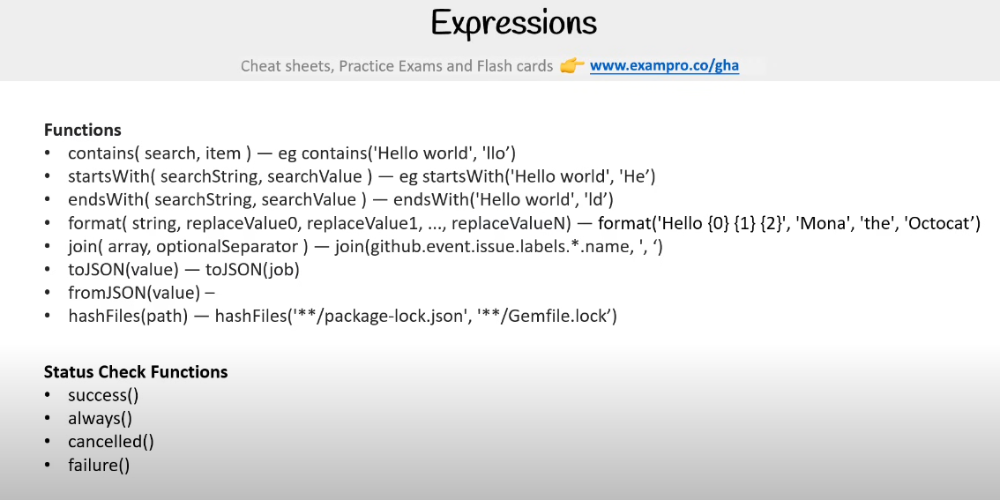

Sure! Here's a more detailed and comprehensive guide on GitHub Actions, covering as much ground as possible, including events, jobs, workflows, and many other advanced concepts:

---

## **GitHub Actions Comprehensive Guide**

### **1. Introduction to GitHub Actions**

GitHub Actions is a feature within GitHub that automates workflows in response to events that occur in a repository. It enables Continuous Integration (CI), Continuous Deployment (CD), and other automation tasks directly in GitHub repositories.

#### **Key Concepts**:
- **Workflow**: A YAML file that defines a set of automated tasks (jobs) that run in response to specific events.
- **Event**: An action that triggers a workflow, such as pushing code or creating a pull request.
- **Job**: A set of steps that run on a specified runner environment.
- **Step**: A single task in a job, which could be a script, a GitHub Action, or a shell command.
- **Runner**: A server or environment that runs your workflow jobs. It can be hosted by GitHub (GitHub-hosted runner) or self-hosted.




---

### **2. Events in GitHub Actions**

Events are the trigger points that activate workflows. Here are the different types of events you can use in GitHub Actions:

#### **Common Event Types**:

1. **Push Event** (`push`):
   - Triggered when commits are pushed to the repository.
   - Can be limited to specific branches or paths.

   ```yaml
   on:
     push:
       branches:
         - main
       paths:
         - '**/*.js'
   ```

2. **Pull Request Event** (`pull_request`):
   - Triggered when a pull request is created or updated.
   - Can be configured to trigger on specific actions, such as opened, edited, or closed.

   ```yaml
   on:
     pull_request:
       types: [opened, closed]
   ```

3. **Issue Event** (`issues`):
   - Triggered when an issue is created, edited, or closed.
   - Useful for automating issue handling or interacting with GitHub Issues.

   ```yaml
   on:
     issues:
       types: [opened, edited, closed]
   ```

4. **Release Event** (`release`):
   - Triggered when a release is created, published, or deleted.

   ```yaml
   on:
     release:
       types: [created, published]
   ```

5. **Workflow Dispatch (Manual Trigger)** (`workflow_dispatch`):
   - Allows a workflow to be triggered manually via the GitHub UI.
   - Supports inputs that can be specified during the manual trigger.

   ```yaml
   on:
     workflow_dispatch:
       inputs:
         deploy_env:
           description: 'Deployment Environment'
           required: true
           default: 'staging'
   ```

6. **Scheduled Event** (`schedule`):
   - Allows workflows to run at specific times, like cron jobs.
   - Can be used for tasks that need to run periodically, such as nightly builds or cleanup jobs.

   ```yaml
   on:
     schedule:
       - cron: '0 0 * * *'  # Runs at midnight every day
   ```

7. **Webhooks** (`webhook`):
   - Custom events that can trigger workflows based on external services or HTTP requests.

8. **Commit Status Event** (`status`):
   - Triggered when the status of a commit changes. This can be used for status checks, build results, etc.

---

### **3. Jobs and Runners**

- **Job**: A set of steps that run in a defined environment, called a **runner**. Jobs can run in parallel or in a defined sequence (one after another).
  
  Example:
  ```yaml
  jobs:
    build:
      runs-on: ubuntu-latest
      steps:
        - name: Checkout Code
          uses: actions/checkout@v2
  ```

- **Runners**: The environment in which your jobs run. There are two types of runners:
  1. **GitHub-hosted runners**: Pre-configured environments provided by GitHub (e.g., Ubuntu, Windows, Mac).
  2. **Self-hosted runners**: Custom environments that you configure yourself.

  Example of using a self-hosted runner:
  ```yaml
  jobs:
    build:
      runs-on: self-hosted
      steps:
        - name: Checkout code
          uses: actions/checkout@v2
  ```

---

### **4. Workflow Components and Structure**

A typical workflow consists of the following components:

1. **name**: A name for your workflow.
2. **on**: Specifies the event that triggers the workflow (e.g., `push`, `pull_request`).
3. **jobs**: Contains one or more jobs to be executed.
4. **steps**: A sequence of individual tasks that make up a job.

Example workflow structure:
```yaml
name: CI Workflow

on:
  push:
    branches:
      - main

jobs:
  build:
    runs-on: ubuntu-latest
    steps:
      - name: Checkout code
        uses: actions/checkout@v2
      - name: Set up Node.js
        uses: actions/setup-node@v2
        with:
          node-version: '14'
      - name: Run tests
        run: npm test
```

---

### **5. Steps in a Job**

Steps are individual tasks that run in a sequence. A step can either run a command or use an action.

1. **Using Actions**:
   Actions are reusable pieces of code that automate common tasks. GitHub provides a marketplace for actions.

   Example:
   ```yaml
   steps:
     - name: Checkout repository
       uses: actions/checkout@v2
   ```

2. **Running Commands**:
   Steps can also run shell commands directly.

   Example:
   ```yaml
   steps:
     - name: Run test script
       run: npm test
   ```

---

### **6. Context and Expressions**

GitHub Actions provides **contexts** and **expressions** to use dynamic values in your workflows. These allow you to access information about the workflow, job, and other entities.

#### **Context**:
A **context** provides information about the workflow run and is used within expressions. Examples include:
- `github` – Information about the GitHub environment (repository name, actor, etc.).
- `env` – Access to environment variables.
- `secrets` – Access to secrets stored in GitHub.

#### **Expression**:
Expressions allow you to evaluate and access context variables dynamically using `${{ }}` syntax.

Example:
```yaml
jobs:
  build:
    runs-on: ubuntu-latest
    steps:
      - name: Print current commit SHA
        run: echo "Commit SHA: ${{ github.sha }}"
```

---

### **7. Environment Variables and Secrets**

- **Environment Variables**: These are global values that are available for the entire job. You can use them to store values that you want to access in multiple steps.

Example of setting environment variables:
```yaml
jobs:
  build:
    runs-on: ubuntu-latest
    env:
      NODE_ENV: 'production'
    steps:
      - name: Print NODE_ENV
        run: echo $NODE_ENV
```

- **Secrets**: Store sensitive data securely in the repository settings, and reference them in your workflow using `${{ secrets.SECRET_NAME }}`.

Example of using a secret:
```yaml
jobs:
  deploy:
    runs-on: ubuntu-latest
    steps:
      - name: Deploy to server
        run: deploy.sh
        env:
          API_KEY: ${{ secrets.API_KEY }}
```

---

### **8. Matrix Builds**

A matrix build allows you to run multiple jobs with different configurations (like testing on different versions of Node.js or Python).

Example of a job matrix:
```yaml
jobs:
  build:
    runs-on: ubuntu-latest
    strategy:
      matrix:
        node: [12, 14, 16]  # Test across three versions of Node.js
    steps:
      - name: Set up Node.js
        uses: actions/setup-node@v2
        with:
          node-version: ${{ matrix.node }}
      - name: Run tests
        run: npm test
```

---

### **9. Caching Dependencies**

GitHub Actions allows you to cache dependencies between workflow runs to save time. This is particularly useful for managing package dependencies (e.g., Node.js `npm` or Python `pip`).

Example:
```yaml
steps:
  - name: Cache Node.js dependencies
    uses: actions/cache@v2
    with:
      path: ~/.npm
      key: ${{ runner.os }}-node-${{ hashFiles('**/package-lock.json') }}
      restore-keys: |
        ${{ runner.os }}-node-
```

---

### **10. Deployments and Publishing**

GitHub Actions can be used to automate deployments and publish content, such as pushing Docker images to Docker Hub or creating releases.

#### **Publish a GitHub Package**:
```yaml
jobs:
  publish:
    runs-on: ubuntu-latest
    steps:
      - name: Publish to GitHub Package Registry
        run: npm publish
        env:
          NODE_AUTH_TOKEN: ${{ secrets.GITHUB_TOKEN }}
```

#### **Deploying to Cloud Providers**:
You can use GitHub Actions to deploy applications to cloud services (e.g., AWS, Azure, Google Cloud) by setting up the appropriate actions or using CLI commands in your steps.

---

### **11. Advanced Topics**

#### **Self-Hosted Runners**:
Setting up self-hosted runners enables you to use your own machines to run workflows. This is useful for more control, custom environments, or private network access.

#### **Reusable Workflows**:
Workflows can be reused across multiple repositories or workflows to avoid duplication.

Example:
```yaml
jobs

:
  reuse:
    uses: user/repo/.github/workflows/reusable-workflow.yml@v1
```

#### **Custom GitHub Actions**:
If existing actions do not meet your needs, you can create custom GitHub Actions using Docker or JavaScript.

---

### **12. Best Practices and Optimization**

1. **Workflow Status Badge**: Add a status badge to your README to show the status of your workflows.

2. **Handling Failures**: Use `continue-on-error: true` for steps or jobs that you do not want to fail the workflow.

3. **Workflow Secrets Management**: Always use GitHub's secrets feature to manage sensitive data securely.

4. **Job Matrix for Parallel Testing**: Use job matrices to run tests across multiple environments (e.g., different OS versions or languages).

---

This comprehensive guide should help you dive deep into GitHub Actions and its capabilities. Let me know if you need more clarification or further examples!


---


## **Scheduling cron Jobs**:


## **Triggering Single or Multiple Events**:


---


### **Webhook Triggers (Built-In GitHub Events)**

GitHub Actions supports a wide range of built-in webhook events. These events are emitted when specific actions occur in your GitHub repository or organization. Below is a categorized list of commonly used events:

#### **Code and Repository Events**
- **`push`**: Triggered on a `git push` to a branch.
- **`pull_request`**: Triggered on PR events like `opened`, `closed`, `merged`, etc.
- **`issues`**: Triggered on issue events like `opened`, `edited`, `deleted`.
- **`create` / `delete`**: Triggered when a branch or tag is created or deleted.
- **`fork`**: Triggered when a repository is forked.
- **`repository_dispatch`**: Custom external trigger (discussed below in detail).

#### **Release and Deployment Events**
- **`release`**: Triggered on events like creating, editing, or publishing a release.
- **`workflow_dispatch`**: Manual workflow trigger via GitHub Actions UI.
- **`deployment`**: Triggered when a deployment is created.
- **`deployment_status`**: Triggered when a deployment status changes.

#### **Collaboration Events**
- **`pull_request_review`**: Triggered when a PR review is submitted.
- **`pull_request_target`**: Similar to `pull_request`, but runs with the target repository's permissions.
- **`discussion`**: Triggered on GitHub Discussions events.
- **`star`**: Triggered when someone stars a repository.

#### **Automation and Security Events**
- **`schedule`**: Triggered on a cron-like schedule (time-based workflows).
- **`workflow_run`**: Triggered when another workflow completes.
- **`check_run` / `check_suite`**: Triggered by status checks.

---

### **Custom Webhook Triggers**

#### **1. `workflow_dispatch` (Manual Trigger)**
This allows you to manually trigger workflows via the GitHub Actions UI, with optional input parameters.

**Example Workflow**:
```yaml
name: Manual Trigger Workflow

on:
  workflow_dispatch:
    inputs:
      environment:
        description: 'Deployment environment'
        required: true
        default: 'production'

jobs:
  manual-trigger:
    runs-on: ubuntu-latest
    steps:
      - name: Print Environment
        run: echo "Deploying to ${{ github.event.inputs.environment }}"
```

---

#### **2. `repository_dispatch` (External Trigger)**

This is triggered by external systems sending a `POST` request to the GitHub API, allowing workflows to respond to events outside GitHub.

**Example Workflow**:
```yaml
name: External Trigger Workflow

on:
  repository_dispatch:
    types:
      - sync-data

jobs:
  external-trigger:
    runs-on: ubuntu-latest
    steps:
      - name: Print Payload
        run: echo "Triggered by: ${{ toJSON(github.event.client_payload) }}"
```

**API Call to Trigger**:
```bash
curl -X POST \
-H "Authorization: Bearer YOUR_GITHUB_TOKEN" \
-H "Accept: application/vnd.github+json" \
https://api.github.com/repos/<OWNER>/<REPO>/dispatches \
-d '{"event_type": "sync-data", "client_payload": {"key": "value"}}'
```

---

### **Types of `repository_dispatch`**

You can define multiple custom `event_type` values:
- **sync-data**
- **run-tests**
- **update-logs**
- These are arbitrary and allow you to customize workflows based on your needs.

---

### **Differences Between `workflow_dispatch` and `repository_dispatch`**
| Feature                | `workflow_dispatch`            | `repository_dispatch`        |
|------------------------|---------------------------------|------------------------------|
| **Triggered By**       | Manual via GitHub UI           | External system/API call     |
| **Supports Inputs**    | Yes                            | Yes (via `client_payload`)   |
| **Use Case**           | Manual triggers for workflows  | Integrating with external systems |

---

### **Examples of Use Cases**

#### **1. Custom CI/CD Pipeline**
Use `repository_dispatch` to trigger a CI/CD pipeline when a new version of software is released in an external system.

#### **2. Synchronize Data**
Trigger workflows to fetch data from APIs, update configurations, or sync databases.

#### **3. Time-Based Automation**
Combine `schedule` and `repository_dispatch` for complex time-based tasks that also require external system integration.

---

These webhook triggers make GitHub Actions versatile, allowing automation for both internal GitHub events and external systems.


---

### Conditionals


---

### 


